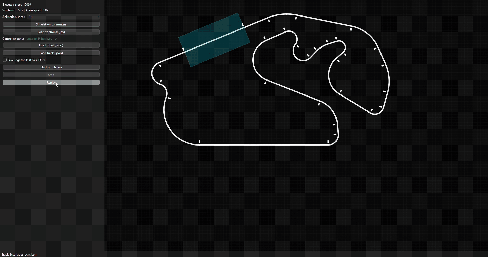
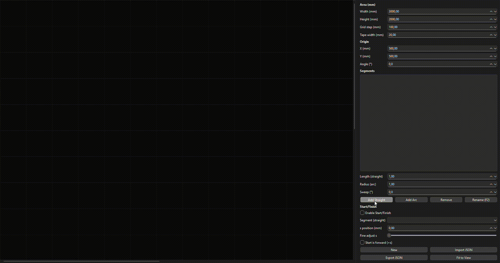
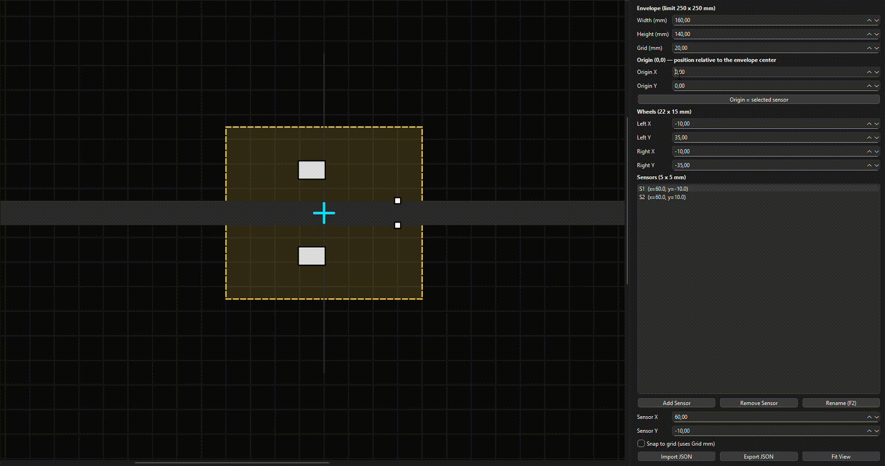

# 🏁 RobotraceSim — Line-Follower Robot Simulator

<p align="center">
  <em>Design tracks, model robots, plug in Python controllers, and run apples-to-apples comparisons in a controlled environment.</em>
</p>

<p align="center">
  <!-- GIF #1 — Simulator (Hero position) -->
  
</p>

<p align="center">
  <a href="#-quick-start">Quick Start</a> •
  <a href="#-simulation-parameters">Simulation Parameters</a> •
  <a href="#-track-editor">Track Editor</a> •
  <a href="#-robot-editor">Robot Editor</a> •
  <a href="#-controllers-python-only">Controllers</a> •
  <a href="#-designing-fair-experiments">Fair Experiments</a>
</p>

---

## ✨ Why RobotraceSim?

The core mission of this project is to create a **controlled, repeatable** environment to compare the performance of an **entire stack**—**robot + controller**—under identical conditions. That lets you:

- Test the **same controller** with different **wheelbase widths**, wheel positions, and dynamics.
- Change the **number and placement of sensors** and quantify the impact.
- Compare **multiple control strategies** (e.g., PID variants, anti-windup schemes) on the **same robot and track**.
- Repeat experiments with the **same parameters** and get **comparable logs**.

---

## 🧭 Track Editor

Design precise line-following tracks with straights and arcs, set **Start/Finish**, and export to JSON. Ideal for controlled benchmarking and repeatable tests.

- Straights & arcs with track width.
- Start/Finish placement (segment, direction, offset).
- JSON import/export for versioning.
- Visual markers and curvature changes to challenge controllers.

<p align="center">
  <!-- GIF #2 — Track Editor (inside Track Editor section) -->
  
</p>

---

## 🤖 Robot Editor

Configure the robot footprint, wheelbase, and sensor array to rapidly iterate on hardware concepts—without touching a real robot.

- Up to ~250×250 mm workspace.
- Wheel sizing/positioning; set wheelbase precisely.
- Add/rename/remove sensors; snap-to-grid.
- Choose an origin (0,0) from a selected sensor for intuitive layouts.
- JSON import/export to version designs alongside code.

<p align="center">
  <!-- GIF #3 — Robot Editor (inside Robot Editor section) -->
  
</p>

---

## 🚀 Quick Start

```bash
# 1) Install dependencies
pip install PySide6

# 2) Open the editors
python track_editor.py    # Track Editor (design tracks)
python robot_editor.py    # Robot Editor (configure robot geometry & sensors)

# 3) (Optional) Adjust Simulation Parameters via the Simulator UI
python simulation.py      # open simulator → Simulation parameters → Save

# 4) Run a simulation
python simulation.py      # load Track (.json), Robot (.json), Controller (.py), then Start
```

---

## 🔬 Simulation Parameters

Simulation settings live in `simulation_parameters.json` (project root) **and** can be edited from the Simulator UI (**Simulation parameters** → Save). Values are validated and persisted for the next runs.

**Common fields:**

| Field                     | Type                  | Typical Range | What it does |
|--------------------------|-----------------------|---------------|--------------|
| `final_linear_speed_mps` | `float`               | 0.1–20.0      | Linear speed (m/s) equivalent at max PWM (±4095). |
| `motor_time_constant_s`  | `float`               | 0.001–0.100   | First-order motor time constant (τ). |
| `simulation_step_dt_ms` | `float`               | 0.5–100.0     | Time between each step of the simulation (ms). |
| `sensor_mode`            | `"analog"`/`"digital"`| —             | How sensors are read/simulated. |
| `value_of_line`          | `int`                 | 0–1023        | Reading when the sensor is on the **line**. |
| `value_of_background`         | `int`                 | 0–1023        | Reading when the sensor is on the **background**. |
| `analog_variation`       | `int`                 | 0–1023        | Noise amplitude for analog mode. |

**Example** — `simulation_parameters.json`:
```json
{
  "final_linear_speed_mps": 2.0,
  "motor_time_constant_s": 0.01,
  "simulation_step_dt_ms": 1.0,
  "sensor_mode": "analog",
  "value_of_line": 255,
  "value_of_background": 0,
  "analog_variation": 50
}
```

---

## 🧩 Controllers (Python-only)

Plug your controller as a `.py` file. The simulator loads it dynamically and calls **`control_step(state)`** every simulation tick.

### Exact function signature and state payload

```python
def control_step(state: dict) -> dict:
    """
    Called every simulation step. Must be non-blocking.
    The simulator passes EXACTLY the following structure and units:

    Parameters
    ----------
    state : dict

        state = {
            "t_ms": int,  # elapsed time [ms] since start (monotonic, starts at 0)

            "pose": {
                "x_mm": float,        # robot origin X in track coordinates [mm]
                "y_mm": float,        # robot origin Y in track coordinates [mm]
                "heading_deg": float  # heading [deg]; 0° = +X axis of the track; positive is CCW
            },

            "vel": {
                "v_mm_s": float,      # linear velocity [mm/s] (after wheel dynamics)
                "omega_rad_s": float  # angular velocity [rad/s]; positive is CCW
            },

            "accel": {
                "a_lin_mm_s2": float,   # linear acceleration [mm/s²]
                "alpha_rad_s2": float   # angular acceleration [rad/s²]
            },

            "sensors": {
                "values": list[int]     # per-sensor readings (0–1023). Index = sensor id in robot-spec
            },

            "wheels": {
                "v_left_mm_s": float,   # left wheel linear speed [mm/s]
                "v_right_mm_s": float   # right wheel linear speed [mm/s]
            }
        }

    Returns
    -------
    dict
        {
            "pwm_left":  int,   # command in [-4095, 4095]
            "pwm_right": int    # command in [-4095, 4095]
        }

    Notes
    -----
    - Commands outside [-4095, 4095] are clipped internally before converting to wheel speed.
    - Use `t_ms * 1e-3` if you prefer seconds.
    - (x_mm, y_mm) is the robot **origin**; geometry comes from `robot-spec.json`.
    - `values` are already ordered as defined in the robot spec.
    """

    # Example (read sensors & keep motors off):
    sn = state["sensors"]["values"]
    t  = state["t_ms"] * 1e-3  # seconds if needed

    # TODO: your control logic here
    return {"pwm_left": 0, "pwm_right": 0}
```


## 🧾 Logging (CSV + JSON)

Turn on **Save logs to file (CSV+JSON)** in the Simulator UI to record every step and key events.
Files are created under `Logs/` with a timestamp:
```
Logs/sim_log_YYYYMMDD_HHMMSS.csv
Logs/sim_log_YYYYMMDD_HHMMSS.json
```

Each simulation step is logged from the worker with:
```python
# Log step
self.logger.log_step(t_ms, x, y, h, v, w, pwmL, pwmR, sensors=sn_vals)
```

**CSV columns (steps):**
```
t_ms, x_mm, y_mm, heading_deg, v_mm_s, omega_rad_s, pwm_left, pwm_right, s0, s1, ..., sN
```
- `s0..sN` are the sensor values for that step (0–1023).

## 📊 Designing Fair Experiments

Since you can fully control the track, robot geometry, sensors, and simulation parameters, you can design apples-to-apples experiments:

- **Same track, different robots** → impact of wheelbase, inertia, and sensor layout.
- **Same robot, different controllers** → PID vs PID+anti-windup vs custom logic.
- **Noise & dt sweeps** → robustness to `analog_variation` and `simulation_step_dt_ms`.
- **Speed ramps** → effect of `final_linear_speed_mps` on overshoot and off-track events.

Export logs and compute comparable metrics (lap time, off-track count, RMS error, etc.).

---

## 📂 Project Structure

```
RobotraceSim/
├── simulation.py                 # Simulator UI & run loop
├── track_editor.py               # Track Editor
├── robot_editor.py               # Robot Editor
├── simulation_parameters.json    # Simulation settings (UI-sync)
├── README.md                     # This file
├── LICENSE                       # Project license
├── docs/
│   └── media/                    # Media files used
├── Utils/                        # Geometry & kinematic models
├── utills_c/                     # Native helpers
├── Example/
│   ├── Controller/               # Python controller examples (.py)
│   ├── Robot/                    # Robot JSON examples
│   └── Track/                    # Track JSON examples
└── Logs/                         # Optional: CSV/JSON logs from runs
```

---

## 🖥️ Requirements

- **Python 3.10+**
- **PySide6**

> Windows builds include a `linesim` geometry DLL for line/track operations as needed.

---

## 🤝 Contributing

Issues and PRs are welcome—especially improvements to visualization, controller examples, and analysis scripts.

---

## 📜 License

Distributed under the **MIT License**. See `LICENSE` for details.

---